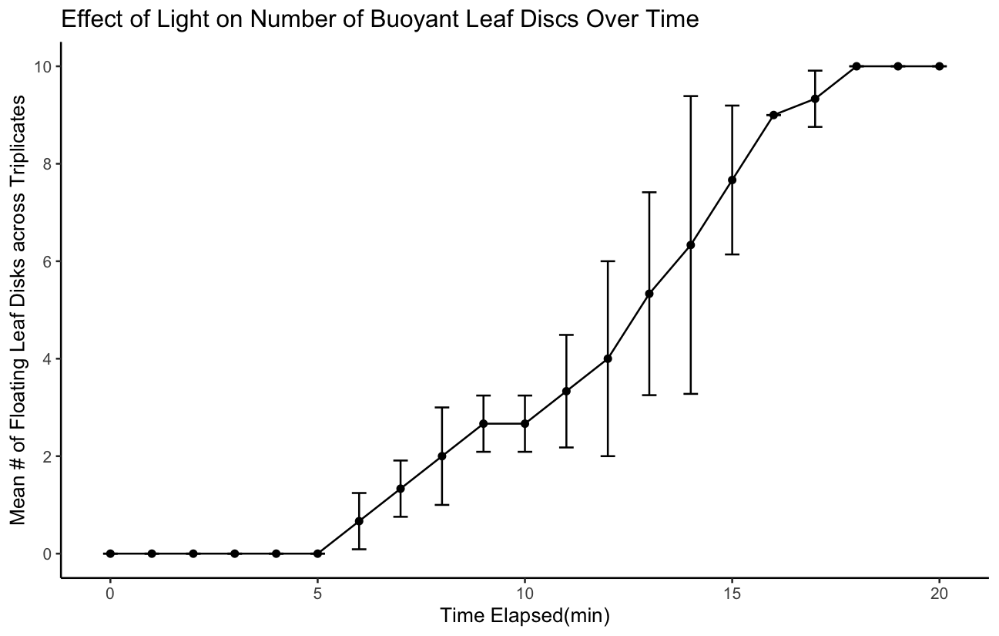
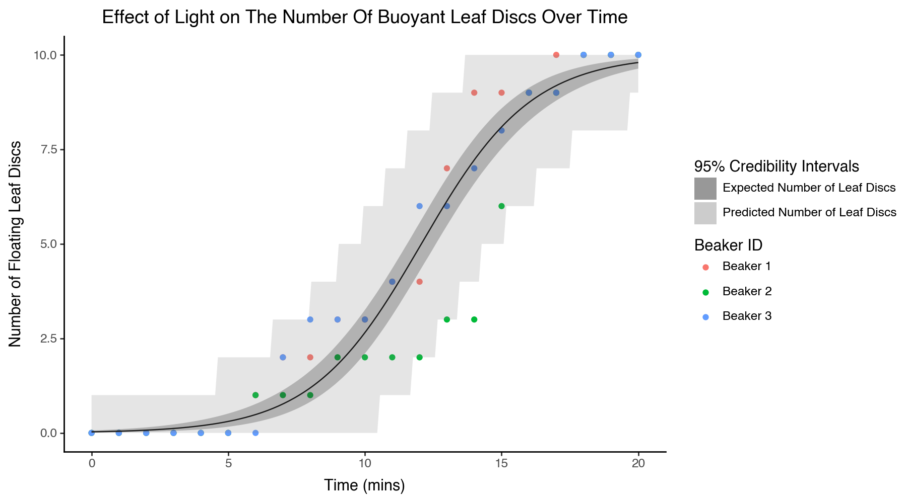
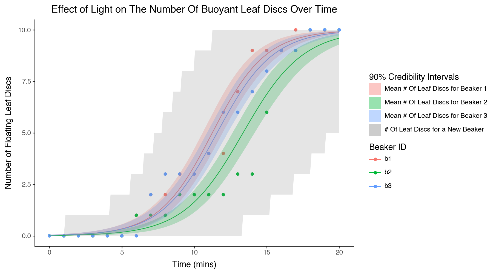

# Modelling Floating Leaf Discs

## A Trip Back In Time
I was originally a molecular biology student in undergrad and in my second year I took a course on plant biology. We had many labs but in one we were to poke holes out of leaves, drop them in a beaker of water, and shine grow lights on them until they floated to the surface. My lab partner and I took measurements every minute to get the following data:

```
time = [0,  1,  2,  3,  4,  5,  6,  7,  8,  9, 10, 11, 12, 13, 14, 15, 16, 17, 18, 19, 20]
b1 =   [0,  0,  0,  0,  0,  0,  1,  2,  2,  3,  3,  4,  4,  7,  9,  9,  9, 10, 10, 10, 10]
b2 =   [0,  0,  0,  0,  0,  0,  1,  1,  1,  2,  2,  2,  2,  3,  3,  6,  9,  9, 10, 10, 10]
b3 =   [0,  0,  0,  0,  0,  0,  0,  2,  3,  3,  3,  4,  6,  6,  7,  8,  9,  9, 10, 10, 10]
```

Now my TA just wanted me to make the simple plot below:



But at this point I was already interested in statisics and knew enough Stan to conceptualize and fit a Bayesian model.

### My First Attempt
At first I thought to treat all observations as independent and fit a simple Binomial generalized linear model:

$$
\begin{aligned}
    C_i &\sim \text{Binomial}(10, p_i) \\
    \text{logit}(p_i) &= \alpha + \beta \cdot t_i
\end{aligned}
$$

> Where $C_i$ denotes the # of leaf discs floating at time $t_i$ for some arbitrary beaker.

Then $\alpha$ and $\beta$ could be thought parameters relating (through some very convoluted mapping) to the actual rate of photosynthesis, the average weight of a disc in an average beaker, etc.

Here is the exact Stan model I initially fit:
```stan
data {
  int<lower=0> Nobs;
  int<lower=0> Nrep;

  array[Nobs, Nrep + 1] int<lower=0> mat; // First column is time, other columns are beakers
}
parameters {
  real alpha;
  real beta;
}
model {
  real time;

  // Priors
  alpha ~ normal(0, 100);
  beta ~ normal(0, 100);

  // Likelihood Loop
  for (i in 1:Nrep) { // Replicates
    for (j in 1:Nobs) { // Observations
      time = mat[j, 1] * 1.0;

      // Likelihood
      mat[j, i + 1] ~ binomial_logit(10, alpha + beta * time );
    }
  }
}
```

> Storing all the data in a single array is not my best work but I was in second year so I give myself some grace.

Which produced the following results:


> If you've read Richard McElreath's Statistical Rethinking then you may be able to tell that I too had just read Richard McElreath's Statistical Rethinking.

However, it's clear that 1) observations from the same beaker are not independent and 2) even observations within the same beaker are not independent as the number of floating discs at a previous timepoint tells us something about the number of floating discs at a later one (the discs cannot somehow sink again, so the values are monotonically increasing).

### My Second Attempt
I did eventually understand point 1) and extended my original model to include a "random-effect" on the beaker ID:

$$
\begin{aligned}
C_{b,i} &\sim \text{Binomial}(10, p_{b,i}) \\
\text{logit}(p_{b,i}) &= \alpha_b + \beta_b \cdot t_i \\
\alpha_b &\sim \text{Normal}(\mu, \sigma) \\
\beta_b &\sim \text{Normal}(\nu, \tau) \\
\end{aligned}
$$

> Where $C_{b,i}$ denotes the # of leaf discs floating at time $t_i$ in beaker $b$.

```stan
data {
  int<lower=0> Nobs;
  int<lower=0> Nrep;

  array[Nobs, Nrep + 1] int<lower=0> counts; // First column is time, other columns are beakers
}
parameters {
  real alphaP;
  real betaP;
  real<lower=0> Adisp;
  real<lower=0> Bdisp;

  vector[Nrep] alphaI;
  vector[Nrep] betaI;
}
model {
  real time;
  // Hyperpriors
  alphaP ~ normal(0, 100);
  betaP ~ normal(0, 100);
  Adisp ~ exponential(1);
  Bdisp ~ exponential(1);

  // Priors
  alphaI ~ normal(alphaP, Adisp);
  betaI ~ normal(Bdisp, Bdisp);

  for (i in 1:3) { // Replicates
    for (j in 1:Nobs) { // Observations
      time = mat[j, 1] * 1.0;

      // Likelihood
      counts[j,i + 1] ~ binomial_logit(10, alphaI[i] + betaI[i] * time );
    }
  }
}
```

Which produced the following results:


I did think about point 2), but I didn't know enough at the time to really model it properly (a discrete-time survival model).


## Redeeming Myself In Bayinx

Let's first get the data into Python:

```py
import polars as pl

data = pl.DataFrame({
    'time': [0,  1,  2,  3,  4,  5,  6,  7,  8,  9, 10, 11, 12, 13, 14, 15, 16, 17, 18, 19, 20],
    'b1':   [0,  0,  0,  0,  0,  0,  1,  2,  2,  3,  3,  4,  4,  7,  9,  9,  9, 10, 10, 10, 10],
    'b2':   [0,  0,  0,  0,  0,  0,  1,  1,  1,  2,  2,  2,  2,  3,  3,  6,  9,  9, 10, 10, 10],
    'b3':   [0,  0,  0,  0,  0,  0,  0,  2,  3,  3,  3,  4,  6,  6,  7,  8,  9,  9, 10, 10, 10]
})
```

### Re-implementing My First Attempt

Instead of storing all my data into a single array, I'm going to structure my counts and timepoints into separate objects and take advantage of broadcasting to avoid explicit loops:

```py
import bayinx as byx
import bayinx.dists as byd
import bayinx.nodes as byn

from jaxtyping import Scalar, Array

# Define my original model with complete pooling
class BinomialCompletePooling(byx.Model):
    alpha: byn.Continuous[Scalar] = byx.define(())
    beta: byn.Continuous[Scalar] = byx.define(())

    counts: byn.Observed[Array] = byx.define(('n_beakers', 'n_timepoints'), lower = 0)
    time: byn.Observed[Array] = byx.define('n_timepoints', lower = 0, upper = 20)

    def model(self, target):
        # Priors
        self.alpha << byd.Normal(0, 100)
        self.beta << byd.Normal(0, 100)

        # Likelihood
        self.counts << byd.Binomial(10, logit_p = self.alpha + self.beta * self.time)

        return target
```

Then we can fit our model and recreate the same plot from before:

```py
import plotnine as gg
import jax.numpy as jnp
import bayinx.ops as byo
import numpy as np

# Construct and fit posterior approximation
post = byx.Posterior(
    BinomialCompletePooling,
    n_beakers = 3,
    n_timepoints = 21,
    counts = data.select(pl.exclude('time')).to_jax().T,
    time = data.get_column('time').to_jax()
)
post.configure([byx.flows.FullAffine()])
post.fit()

# Compute posterior predictives
time = jnp.linspace(0, 20, 200)
pred_mean = post.predictive(
    lambda model, key: byo.sigmoid(model.alpha + model.beta * time) * 10,
    int(2e4)
)
pred_new = post.predictive(
    lambda model, key: byd.Binomial(10, logit_p = model.alpha + model.beta * time).sample(time.shape, key),
    int(2e4)
)

# Format observed data for plotting
plot_data = data.unpivot(
    index = 'time',
    variable_name = 'beaker_id',
    value_name = 'count'
).with_columns(
    pl.col('beaker_id')
)

# Format posterior predictives
pred_plot_data = pl.DataFrame({
    'time': np.array(time),
    'mean_num': np.array((pred_mean).mean(0)),
    'mean_num_lb': np.array(jnp.quantile(pred_mean, 0.025, axis = 0)),
    'mean_num_ub': np.array(jnp.quantile(pred_mean, 0.975, axis = 0)),
    'new_lb': np.array(jnp.quantile(pred_new, 0.025, axis = 0)),
    'new_ub': np.array(jnp.quantile(pred_new, 0.975, axis = 0))
})

# Recreate original plot
plot = (
    gg.ggplot(plot_data, gg.aes(x = 'time', y = 'count', color = 'beaker_id')) +
        gg.geom_point() +
        gg.geom_line(
            gg.aes(x = 'time', y = 'mean_num'),
            pred_plot_data,
            inherit_aes = False
        ) +
        gg.geom_ribbon(
            gg.aes(x = 'time', ymin = 'mean_num_lb', ymax = 'mean_num_ub', fill = "'Expected Number of Leaf Discs'"),
            pred_plot_data,
            inherit_aes = False,
            size = 0,
            alpha = 0.25
        ) +
        gg.geom_ribbon(
            gg.aes(x = 'time', ymin = 'new_lb', ymax = 'new_ub', fill = "'Predicted Number of Leaf Discs'"),
            pred_plot_data,
            inherit_aes = False,
            size = 0,
            alpha = 0.2
        ) +
        gg.theme_classic() +
        gg.labs(
            title = 'Effect of Light on The Number Of Buoyant Leaf Discs Over Time',
            x = 'Time (mins)',
            y = 'Number of Floating Leaf Discs',
            color = 'Beaker ID',
            fill = '95% Credibility Intervals'
        ) +
        gg.scale_fill_manual(
            values = {
                'Expected Number of Leaf Discs': 'black',
                'Predicted Number of Leaf Discs': 'gray'
            }
        ) +
        gg.scale_color_discrete(
            labels = {'b1': 'Beaker 1', 'b2': 'Beaker 2', 'b3': 'Beaker 3'}
        )
)
plot.save('docs/examples/intro/leaf_discs/images/new_binomial_glm_plot.png', width = 9, height = 5)
```


### Re-implementing My Second Attempt

```py
# Define my modified model with partial pooling
class BinomialPartialPooling(byx.Model):
    mean_alpha: byn.Continuous[Scalar] = byx.define(())
    scale_alpha: byn.Continuous[Scalar] = byx.define((), lower = 0)
    mean_beta: byn.Continuous[Scalar] = byx.define(())
    scale_beta: byn.Continuous[Scalar] = byx.define((), lower = 0)

    alpha: byn.Continuous[Array] = byx.define(('n_beakers', 1))
    beta: byn.Continuous[Array] = byx.define(('n_beakers', 1))

    counts: byn.Observed[Array] = byx.define(('n_beakers', 'n_timepoints'), lower = 0)
    time: byn.Observed[Array] = byx.define('n_timepoints', lower = 0, upper = 20)

    def model(self, target):
        # Hyperpriors
        self.mean_alpha << byd.Normal(0, 100)
        self.mean_beta << byd.Normal(0, 100)
        self.scale_alpha << byd.Exponential(1)
        self.scale_beta << byd.Exponential(1)

        # Priors
        self.alpha << byd.Normal(self.mean_alpha, self.scale_alpha)
        self.beta << byd.Normal(self.mean_beta, self.scale_beta)

        # Likelihood
        self.counts << byd.Binomial(10, logit_p = self.alpha + self.beta * self.time)

        return target
```

```py
# Construct and fit posterior approximation
post = byx.Posterior(
    BinomialPartialPooling,
    n_beakers = 3,
    n_timepoints = 21,
    counts = data.select(pl.exclude('time')).to_jax().T,
    time = data.get_column('time').to_jax()
)
post.configure([byx.flows.FullAffine()])
post.fit(max_iters = int(1e6))

# Compute posterior predictives
time = jnp.linspace(0, 20, 200)

# Posterior predictive of the expected count for each beaker
pred_means = post.predictive(
    lambda model, key: byo.sigmoid(model.alpha + model.beta * time) * 10,
    int(1e4)
)

# Posterior predictive of the count for a new beaker
def new_beaker(model: BinomialPartialPooling, key):
    # Simulate parameters for a new beaker
    new_alpha = byd.Normal(model.mean_alpha, model.scale_alpha).sample((), key)
    new_beta = byd.Normal(model.mean_beta, model.scale_beta).sample((), key)

    # Simulate new count for each timepoint
    counts = byd.Binomial(
        10,
        logit_p = new_alpha + new_beta * time
    ).sample(time.shape, key)

    return counts
pred_new = post.predictive(
    new_beaker,
    int(1e4)
)

# Format posterior predictive for expected count in existing beakers
pred_means_plot_data = (
    pl.DataFrame({
        'time': np.array(time),
        'mean_num': np.array(pred_means.mean(0)).T,
        'mean_num_lb': np.array(jnp.quantile(pred_means, 0.05, axis = 0)).T,
        'mean_num_ub': np.array(jnp.quantile(pred_means, 0.95, axis = 0)).T
    })
    .with_columns(
        beaker_id = ['b1', 'b2', 'b3']
    )
    .explode('mean_num', 'mean_num_lb', 'mean_num_ub', 'beaker_id')
)

# Format posterior predictive of the count for a new beaker
pred_new_plot_data = pl.DataFrame({
    'time': np.array(time),
    'new_num_lb': np.array(jnp.quantile(pred_new, 0.05, axis = 0)),
    'new_num_ub': np.array(jnp.quantile(pred_new, 0.95, axis = 0))
})

# Recreate original plot
plot = (
    # Plot observed data
    gg.ggplot(plot_data, gg.aes(x = 'time', y = 'count', color = 'beaker_id')) +
        gg.geom_point() +
        # Visualize posterior for existing beakers
        gg.geom_line(
            gg.aes(x = 'time', y = 'mean_num', color = 'beaker_id', fill = 'beaker_id'),
            pred_means_plot_data,
            inherit_aes = False
        ) +
        gg.geom_ribbon(
            gg.aes(x = 'time', ymin = 'mean_num_lb', ymax = 'mean_num_ub', fill = "beaker_id"),
            pred_means_plot_data,
            inherit_aes = False,
            size = 0,
            alpha = 0.25
        ) +
        # Visualize posterior for a new beaker
        gg.geom_ribbon(
            gg.aes(x = 'time', ymin = 'new_num_lb', ymax = 'new_num_ub', fill = "'new_beaker'"),
            pred_new_plot_data,
            inherit_aes = False,
            size = 0,
            alpha = 0.2
        ) +
        gg.theme_classic() +
        gg.labs(
            title = 'Effect of Light on The Number Of Buoyant Leaf Discs Over Time',
            x = 'Time (mins)',
            y = 'Number of Floating Leaf Discs',
            color = 'Beaker ID',
            fill = '90% Credibility Intervals'
        ) +
        gg.scale_fill_manual(
            values = {
                'b1': '#F8766D',
                'b2': '#00BA38',
                'b3': '#619CFF',
                'new_beaker': 'gray'
            },
            labels = {
                'b1': 'Mean # Of Leaf Discs for Beaker 1',
                'b2': 'Mean # Of Leaf Discs for Beaker 2',
                'b3': 'Mean # Of Leaf Discs for Beaker 3',
                'new_beaker': '# Of Leaf Discs for a New Beaker'
            }
        )
)
plot.save('docs/examples/intro/leaf_discs/images/new_binomial_glmm_plot.png', width = 9, height = 5)
```

